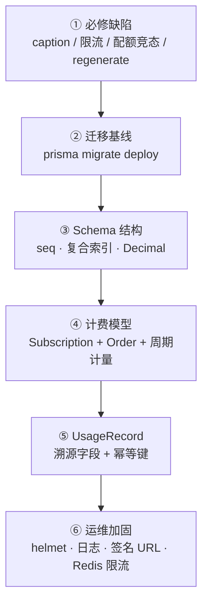
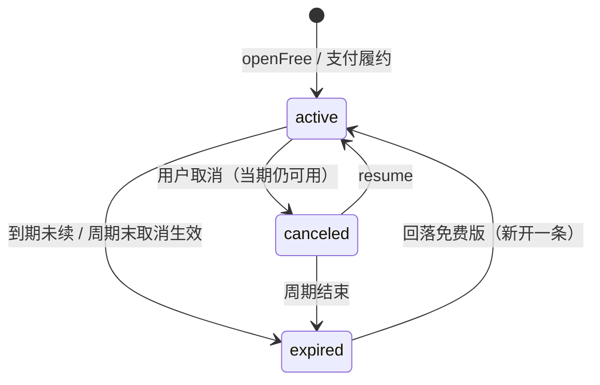
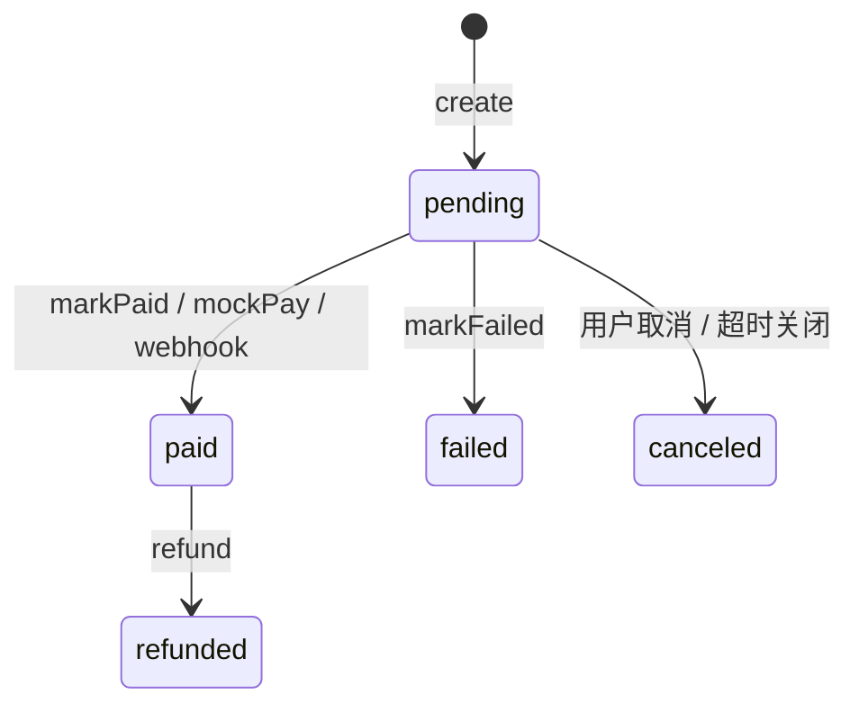

# 蛙宝 AI 工作台 · 后端设计加固与计费模型重构

> 关联文档：[P1 文本阶段原型与接口设计](./2026-07-21-16_15-P1-文本阶段-原型与接口设计.md) · [P2 图像阶段原型与接口设计](./2026-07-31-P2-图像阶段-原型与接口设计.md) · [技术架构决策](./2026-07-21-16_15-技术架构决策-前后端与选型.md) · [本地启动与前后端对接指南](./2026-07-22-14_26-本地启动与前后端对接指南.md)
>
> 范围：`apps/api` 后端表设计与业务加固——配额竞态、订阅/订单计费、用量溯源、运维安全；同步修正限流、消息排序、BFF 透传等既有缺陷。
>
> 状态：**已落地**（单元测试 292 / e2e 44 全绿；迁移已 deploy 至云 PostgreSQL）

---

## 目录

1. [背景与动机](#一背景与动机)
2. [变更总览](#二变更总览)
3. [必修缺陷修复](#三必修缺陷修复)
4. [迁移基线与 Schema 结构优化](#四迁移基线与-schema-结构优化)
5. [计费模型：Subscription / Order](#五计费模型subscription--order)
6. [UsageRecord 溯源与幂等](#六usagerecord-溯源与幂等)
7. [运维加固](#七运维加固)
8. [接口变更一览](#八接口变更一览)
9. [环境变量](#九环境变量)
10. [迁移与部署说明](#十迁移与部署说明)
11. [验收标准](#十一验收标准)

---

## 一、背景与动机

对 `apps/api` 的 Prisma schema、业务服务与 BFF 对接做了一次完整审查后，发现若干会直接出错或在接支付/多副本前必须补齐的问题：

| 严重度 | 问题 | 影响 |
| --- | --- | --- |
| P0 | `image-caption` 模板未入种子库 | 图生文案在真实库上外键失败 |
| P0 | BFF 代理下 IP 限流失效 | 全站共享一份额度，易被打满 |
| P0 | 配额「先查后写」存在竞态 | 并发请求可超套餐额度 |
| P1 | 无 Prisma migrations 历史 | 生产 schema 演进不可追溯、易误 DROP |
| P1 | `createdAt` 毫秒碰撞导致消息乱序 | regenerate上下文可能含旧回复 |
| P1 | `cost` 用 Float | 对账浮点漂移 |
| P1 | 无 Subscription / Order | 无法按订阅周期计量，也无支付凭据 |
| P2 | UsageRecord 无业务回指 / 幂等键 | 重试双计、争议难溯源 |
| P2 | 媒体 `/uploads` 裸链可猜 | 隐私风险；缺 helmet / 请求日志 / Redis 限流 |

本次按「必修 → 迁移基线 → 计费模型 → 溯源 → 运维」顺序落地，避免在无迁移体系时继续 `db push`。

---

## 二、变更总览



| 轮次 | 内容 | 关键产物 |
| --- | --- | --- |
| 1 | 必修缺陷 | seed `image-caption`；`AppThrottlerGuard` 按 userId；`QuotaCounter` + 原子预留 |
| 2 | 迁移与结构 | `prisma/migrations/*`；`Message.seq`；复合索引；`cost → Decimal(12,6)` |
| 3 | 计费 | `Subscription` / `Order`；周期滚动；升降级；订单状态机 |
| 4 | 溯源 | `UsageRecord` 回指 + `idempotencyKey` |
| 5 | 运维 | helmet、请求日志、签名媒体、可选 Redis 限流 |

---

## 三、必修缺陷修复

### 3.1 图生文案外键

- `CAPTION_TEMPLATE_ID` 抽到 `@wabao/shared`
- `prisma/seed.ts` 注入 `enabled: false` 的内部模板 `image-caption`，对用户不可见但对 `Creation.templateId` 合法

### 3.2 限流在 BFF 下失效

浏览器流量经 Next `/bff` 转发，后端看到的来源 IP 恒为 BFF 自身。

| 改动点 | 说明 |
| --- | --- |
| `main.ts` | `trust proxy = TRUST_PROXY_HOPS`（默认 1） |
| BFF `forwardedForHeaders` | 透传 `X-Forwarded-For` / `X-Forwarded-Proto` |
| `AppThrottlerGuard` | 已登录按校验后的 JWT `sub` 计数；匿名回落客户端 IP |

### 3.3 配额竞态

新增 `quota_counters` 表，以 `INSERT … ON CONFLICT DO UPDATE` 条件自增做原子预留：

- Token：调模型前 `reserve`（含保守输出预估）→ `finally` 里 `settle` 修正
- 图像：生成前 `reserve` → 失败/不足张数时 `release`

计量周期键改为**订阅周期起点 ISO 字符串**（见第五节），不再用 UTC 自然月。

### 3.4 regenerate 上下文与消息排序

- `Message.seq`（全局 `autoincrement`）作为唯一排序键；历史数据按 `created_at, id` 回填
- `buildContext` 支持 `beforeSeq`，并剔除已被 supersede 的旧回复（`parentId` 链）

### 3.5 其它小修

- `AnalyzeImageDto.image_urls` 增加 `@ArrayMaxSize(MAX_ANALYZE_IMAGES)`
- 变体重绘支持 `stream: false`（DTO 声明 + 控制器，避免 `whitelist` 剥字段）
- e2e 中 `invalid_request` 期望由 422 纠正为 400

---

## 四、迁移基线与 Schema 结构优化

### 4.1 迁移策略

| 约定 | 说明 |
| --- | --- |
| 使用 `prisma migrate deploy` | 替代 `db push` 作为正式初始化路径 |
| **禁止**在共享/云库上跑 `migrate dev` | diff 可能对云厂商拨测表生成 `DROP TABLE` |
| 手写增量 SQL | 剔除无关 DROP，并补数据回填逻辑 |
| 已有库 | 先 `prisma:baseline` 标记 `00000000000000_init`，再 deploy 后续迁移 |

迁移清单：

| 目录 | 内容 |
| --- | --- |
| `00000000000000_init` | 基线（空库建全表） |
| `20260804000001_add_quota_counters` | `QuotaKind` + `quota_counters` |
| `20260804000002_add_message_seq_and_indexes` | `messages.seq` 回填 + 复合索引 |
| `20260804000003_cost_to_decimal` | 四处 `cost` → `DECIMAL(12,6)` |
| `20260804000004_add_subscriptions_and_orders` | 订阅/订单表 + 存量用户回填 |
| `20260804000005_usage_record_traceability` | 用量溯源字段 + 幂等键 |

### 4.2 索引对齐查询

热路径改为复合索引，例如：

- `conversations (userId, pinned, updatedAt)`
- `messages (conversationId, seq)`
- `usage_records / creations / media_assets / moderation_records (userId, createdAt)`
- `media_assets (userId, url)`（归属校验）

---

## 五、计费模型：Subscription / Order

### 5.1 设计原则

1. **每个用户恒有一条 active 订阅**（注册时开通免费版；部分唯一索引保证）
2. **配额按订阅周期计量**（30 天滚动），月中升级不把旧消耗算进新额度
3. **升级立即生效，降级/取消周期末生效**（`pendingPlan`）
4. **付费变更经由订单**：支付回调幂等履约，禁止直接改 `user.plan` 当唯一真相
5. `users.plan` / `users.quota_tokens` 保留为冗余快照，仅由 `SubscriptionService` 同步

### 5.2 周期与状态



- 年付：`expiresAt` 一年后，**额度仍每 30 天滚动重置**
- 免费版：`expiresAt = null`，避免滚动任务停摆导致全体失效
- 惰性滚动：任意读取 `current()` 时推进过期周期，不依赖定时任务也能正确重置

### 5.3 订单状态机（幂等）



幂等约定：

- `order_no` 对外唯一；`provider_txn_id` 全局唯一
- `markPaid` 用 `UPDATE … WHERE status='pending'` 抢锁；同交易号重复回调直接返回
- 履约失败时订单保持 `paid`，`metadata.fulfill_error` 供补单

### 5.4 运行模式

| `PAYMENT_PROVIDER` | 行为 |
| --- | --- |
| `mock`（默认） | `subscribe` 升档/续期：建单 → 自动 `mockPay` → 立即履约（兼容现有 e2e / 本地） |
| 真实渠道名 | 返回 `pending_order`，前端跳转收银台；Webhook → `markPaid` |

降档 / 切免费：**无资金流**，直接走订阅状态机，不建单。

---

## 六、UsageRecord 溯源与幂等

新增字段（裸字符串、无 FK，实体删除后仍保留审计）：

| 字段 | 用途 |
| --- | --- |
| `message_id` | 对话 / Vision 回指消息 |
| `creation_id` | 创作 / 图生文案 |
| `media_asset_id` | 图像按张计量 |
| `idempotency_key` | 唯一；重复落账返回已有成本 |

键约定：

- `chat:{messageId}`
- `studio:{creationId}`
- `image:{mediaAssetId}`
- `vision:msg:{messageId}` / `vision:creation:{creationId}`

图像落账统一走 `UsageService.record`（支持 `cost` 覆盖按张计价），不再直接 `prisma.usageRecord.create`。

---

## 七、运维加固

### 7.1 安全响应头与请求日志

- `helmet`（`crossOriginResourcePolicy: cross-origin`，便于跨域拉媒体）
- 每请求生成/透传 `x-request-id`，结束时打结构化访问日志（不含 query/body）
- `app.enableShutdownHooks()`

### 7.2 媒体签名 URL

| 项 | 说明 |
| --- | --- |
| 库内存储 | 永远是无签名相对路径 `/uploads/xxx.png` |
| API 出站 | `StorageService.signUrl` → `?exp=&sig=`（HMAC-SHA256） |
| 读取 | 默认强制验签；`MEDIA_REQUIRE_SIGNED=false` 可本地裸链调试 |
| 附件落库 | 对话 attachments 先 `toRelativeUrl` 再存，避免签名过期导致历史失效 |

### 7.3 Redis 限流（可选）

- 配置 `REDIS_URL` → `RedisThrottlerStorage` 多副本共享计数
- 连接失败**回退内存**，不阻断启动
- Tracker 仍为 `user:{id}` / `ip:{addr}`（见 3.2）

### 7.4 Health

`GET /api/v1/health` 增加 `db: up|down`；库不可达时 `status: degraded`。

---

## 八、接口变更一览

### 8.1 计费 / 订单（新增或语义增强）

| 方法 | 路径 | 说明 |
| --- | --- | --- |
| GET | `/plans` | 套餐目录（公开，不变） |
| GET | `/billing/subscription` | 含周期、`pending_plan`、`canceled_at` 等 |
| POST | `/billing/subscriptions` | mock 下升档立即履约；真实渠道返回 `pending_order` |
| DELETE | `/billing/subscription` | 取消（周期末回落免费） |
| POST | `/billing/subscription/resume` | 撤销取消 |
| POST | `/billing/orders` | 创建待支付订单 |
| GET | `/billing/orders` | 我的订单列表 |
| GET | `/billing/orders/:orderNo` | 订单详情 |
| DELETE | `/billing/orders/:orderNo` | 取消待支付单 |
| POST | `/billing/orders/:orderNo/mock-pay` | 仅 mock 环境模拟支付 |
| POST | `/billing/webhooks/:provider` | 支付回调（`x-wabao-signature`） |

订阅 DTO 关键字段：`status`、`cycle`、`quota_tokens`、`monthly_images`、`current_period_start/end`、`expires_at`、`pending_plan`、`canceled_at`。

### 8.2 图像

- 列表/详情/生成结果中的 `url` 在强制签名模式下带 `exp`/`sig`
- 客户端回传图片 URL 时可用签名形态；服务端会归一化为相对路径再做归属校验

---

## 九、环境变量

在 `apps/api/.env.example` 中新增/明确：

| 变量 | 默认 | 说明 |
| --- | --- | --- |
| `TRUST_PROXY_HOPS` | `1` | BFF 直连为 1；再套 Nginx/CDN 按层数加 |
| `PAYMENT_PROVIDER` | `mock` | `mock` 或真实渠道名 |
| `PAYMENT_WEBHOOK_SECRET` | 空 | mock 未配密钥时放行；正式渠道必配 |
| `MEDIA_SIGNING_SECRET` | 回退 JWT | 媒体 HMAC 密钥 |
| `MEDIA_URL_TTL_SECONDS` | `3600` | 签名有效期 |
| `MEDIA_REQUIRE_SIGNED` | `true` | `false` 时开放裸链（仅建议本地） |
| `REDIS_URL` | 空 | 配置后限流走 Redis |

跑 e2e 建议：

```powershell
$env:OPENAI_API_KEY=""; pnpm --filter @wabao/api test:e2e
```

（避免 dotenv 未覆盖已有 Key 时误打真实生图接口。）

清理 e2e 用户可执行：

```bash
pnpm --filter @wabao/api exec node scripts/cleanup-e2e-users.mjs
```

---

## 十、迁移与部署说明

### 10.1 新环境

```bash
pnpm --dir packages/shared build
pnpm --filter @wabao/api prisma:deploy
pnpm --filter @wabao/api seed
```

根脚本 `db:init` 已改为上述路径（deploy，而非 push）。

### 10.2 已有云库（已有表、无迁移历史）

```bash
pnpm --filter @wabao/api prisma:baseline   # 标记 init 已应用
pnpm --filter @wabao/api prisma:deploy     # 应用 00001~00005
pnpm --filter @wabao/api seed              # upsert 含 image-caption
```

### 10.3 注意

- 切勿在生产对共享库执行 `prisma migrate dev` / `db push`
- `apps/api/prisma/sql/*.sql` 为历史脚本，见该目录 README，不再作为正式迁移路径
- 重启 API 后运维相关 env（签名、Redis、支付）才会生效

---

## 十一、验收标准

| # | 标准 | 结果 |
| --- | --- | --- |
| 1 | 单元测试全绿 | ✅ 292 passed |
| 2 | e2e（mock AI）全绿 | ✅ 44 passed |
| 3 | `prisma migrate status` 无 pending | ✅ 6 migrations applied |
| 4 | 新用户注册即有 free 订阅；升档后配额按新周期计 | ✅ |
| 5 | mock 支付：`subscribe` plus 后图像进阶权益解锁 | ✅ e2e「升级套餐」组 |
| 6 | 无签名访问 `/uploads/xxx` 返回 403（`MEDIA_REQUIRE_SIGNED=true`） | ✅ 中间件验签 |
| 7 | 同一 `idempotency_key` 重复 `record` 不双计 | ✅ 单测覆盖 |
| 8 | 并发配额预留不超过套餐上限 | ✅ QuotaService / Usage / ImageQuota 单测 |

---

## 附录：关键文件索引

| 区域 | 路径 |
| --- | --- |
| Schema | `apps/api/prisma/schema.prisma` |
| 迁移 | `apps/api/prisma/migrations/` |
| 订阅 | `apps/api/src/modules/billing/subscription.service.ts` |
| 订单 | `apps/api/src/modules/billing/order.service.ts` |
| 计费 API | `apps/api/src/modules/billing/billing.{controller,service}.ts` |
| 配额原子 | `apps/api/src/common/quota.service.ts` |
| 用量 | `apps/api/src/modules/users/usage.service.ts` |
| 限流 | `apps/api/src/common/guards/app-throttler.guard.ts` · `throttler-redis.storage.ts` |
| 签名媒体 | `apps/api/src/modules/images/storage.service.ts` · `common/middleware/signed-media.middleware.ts` |
| 启动 | `apps/api/src/main.ts` |
| 共享常量 | `packages/shared/src/index.ts` |
